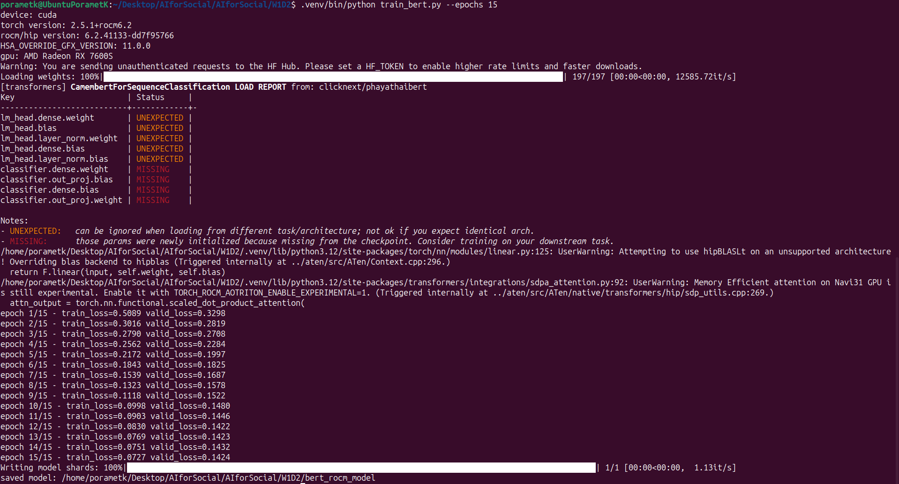
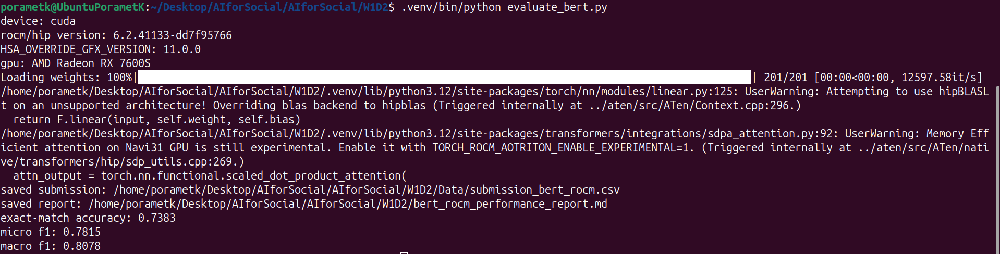

# 6610110554 นายปรเมษ แก้วอุบล

# รายงานประสิทธิภาพโมเดล PhayaThaiBERT บน AMD GPU/ROCm

## Model

- Base model: `clicknext/phayathaibert`
- Architecture: `AutoModelForSequenceClassification`
- Task: multi-label classification
- Activation: sigmoid
- Loss: BCEWithLogitsLoss
- Learning rate: `2e-05`
- Epochs: `15`
- Batch size: `8`
- Max length: `256`
- Device during train: `cuda`
- ROCm/HIP version: `6.2.41133-dd7f95766`

หมายเหตุ: `test.csv` ไม่มีเฉลย `tag` จึงวัด metric จาก validation split ของ `train.csv` และสร้าง submission จาก `test.csv`

## Validation Metrics

- Exact-match accuracy: 0.7383
- Micro precision: 0.7686
- Micro recall: 0.7949
- Micro F1-score: 0.7815
- Macro precision: 0.8409
- Macro recall: 0.8020
- Macro F1-score: 0.8078
- Samples precision: 0.7664
- Samples recall: 0.7804
- Samples F1-score: 0.7695
- Hamming loss: 0.0405
- Samples Jaccard score: 0.7617
